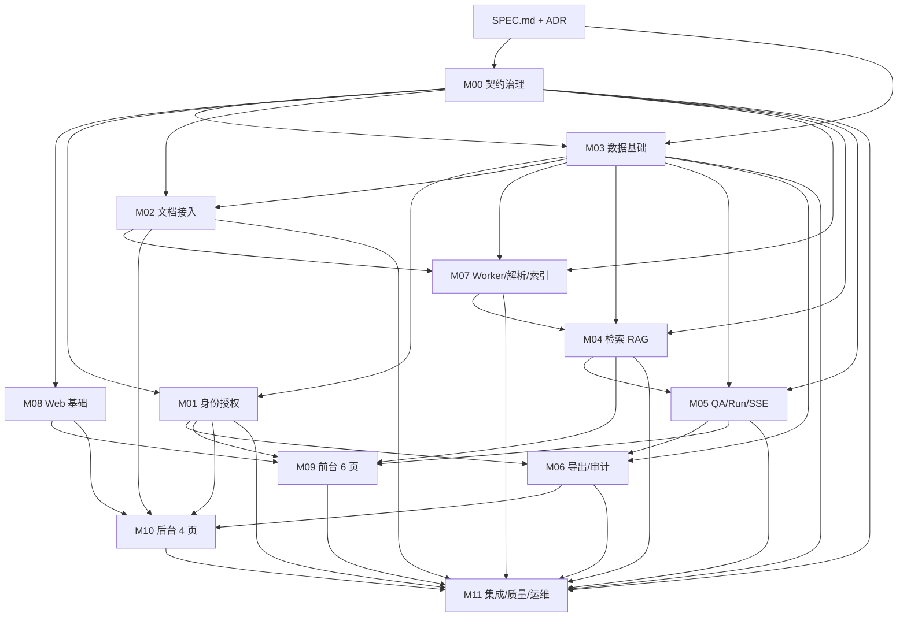

# 问枢 Pivot 分模块并行开发规格

> **文档 ID**：`MODULE-SPEC-1.0`  
> **状态**：accepted（并行开发基线）  
> **适用仓库**：`Lumina-888/Pivot`  
> **生效日期**：2026-09-06  
> **上位规范**：[`SPEC.md`](SPEC.md)（SPEC-1.0）

## 0. 文档定位与优先级

本文是问枢 Pivot 在多个会话、多个 worktree 中并行开发时的**模块边界与协作规范**。它只补充原 SPEC 没有展开的工程协作信息：

- 模块边界、唯一负责人与跨模块贡献关系；
- 模块之间的依赖 DAG 与并行波次；
- 公共契约、共享文件、目录和测试的所有权；
- 分支、worktree、提交、标签、集成和交接流程；
- 每个模块的 DoR、DoD、首批测试和验收证据。

本文**不替代、不改写、不重新解释** `SPEC.md`。凡与 `SPEC.md`、已批准 ADR 或冻结契约冲突的内容，以优先级更高者为准。本文不得自行冻结 `TBD-P0`，不得把原 SPEC 的历史文档静默改写为新口径。

### 0.1 文档优先级

从高到低：

1. `SPEC.md`：需求、状态机、数据不变量、API/SSE/Worker 语义和验收门槛的规范源；
2. 已批准 ADR：对开放决策的显式裁决；
3. 本文 `MODULE_SPEC.md`：模块边界与并行协作规范；
4. `spec/contracts/` 中带版本的机器可读契约；
5. `AGENTS.md`、`PROGRESS.md` 与 `progress/`：执行规则和进度记录；
6. 具体模块设计文档与实现代码；
7. `风格样稿/`：UI 信息架构与视觉基线，Mock 行为不等于生产能力。

### 0.2 不在本文中解决的事项

以下内容仍须回到 `SPEC.md` 或 ADR：模型供应商最终选择、检索参数、文件资源限制、分页方案、超时预算、质量阈值、保留期限、RPO/RTO 等 `TBD-P0`；任何状态机、权限、引用/删除语义或模型/检索配置的改变。

---

## 1. 并行开发目标与基本原则

本仓库通常同时开启 **5–6 个开发会话**。每个会话在独立 Git worktree 中工作，按一个模块任务包交付。`main` 只接受已验证的集成结果。

### 1.1 不可违反的原则

1. **先契约、后实现**：消费者只能依赖已冻结版本的 API、SSE、Worker、领域状态和数据接口。
2. **一个文件一个 Owner**：模块可读取其他模块文件，但只能修改所有权表中自己的路径。
3. **一个需求一个 Accountable**：跨模块需求必须指定唯一最终负责模块，其余为 Contributors；不能以“对方模块负责”为由遗漏验收。
4. **TDD 不变**：每个开发单元遵循 Red → Contract → Green → Refactor → Integration → Regression，测试命名遵循 `test_<requirement_id>_<behavior>()`。
5. **Fake/Stub 隔离外部服务**：单元和大多数契约测试不使用真实密钥或真实供应商 API；真实供应商只在明确标注的冒烟测试中调用。
6. **不私设 TBD**：发现实现需要未冻结参数时，登记 `TBD-P0` 或变更申请，不在代码中悄悄填默认值。
7. **集成分支不修业务规则**：集成会话可以修复合并冲突、构建配置和测试装配；业务语义缺陷退回 Accountable 模块。
8. **所有结论可交接**：完成项、未完成项、测试证据、已知差距、下一步和变更申请必须写入模块进度文件。

### 1.2 并行会话的最小开场动作

每个新会话在写代码前必须读取：

```text
SPEC.md
MODULE_SPEC.md
AGENTS.md
PROGRESS.md
progress/modules/<自己的模块>.md
当前波次的集成 tag 或基线 commit
```

然后确认：自己的分支、worktree、允许修改路径、依赖契约版本、首批 Red 测试和未决 ADR。任何一项不满足 DoR，都只能先补齐文档或提交变更申请，不能直接扩大实现范围。

---

## 2. 模块总览

本项目划分为 12 个稳定模块。模块编号是长期标识，不因会话更换而复用。

| ID | 模块 | 主要需求 | Accountable 交付物 | 主要依赖 |
|---|---|---|---|---|
| M00 | 规格治理与公共契约 | 需求追踪、§5 契约、场景、验收矩阵 | OpenAPI/SSE/Worker schema、feature、矩阵 | SPEC、ADR |
| M01 | 身份、会话与授权 | FR-AUTH、FR-RBAC、认证安全 | Auth API、Token、RBAC、资源授权 | M00、M03 |
| M02 | 文档领域与接入 | FR-DOC | 上传校验、版本生命周期、删除语义 | M00、M03 |
| M03 | 数据基础与持久化 | §2、§9 存储不变量 | ORM、迁移、Repository、存储适配器 | M00 |
| M04 | 搜索与检索 RAG | FR-SEARCH、FR-RAG | 混合检索、过滤、scope、重排 | M00、M03、M07 |
| M05 | 问答编排、Run 与 SSE | FR-QA、FR-STREAM | LangGraph 主图、Claim/Citation、SSE | M00、M03、M04 |
| M06 | 导出、审计与成本元数据 | FR-EXPORT、FR-AUDIT | 导出授权、审计、ProviderCall | M00、M01、M03、M05 |
| M07 | Worker、解析与索引任务 | §3.1、§5.7、§6.1–6.2 | Celery、解析、分块、Embedding、索引 | M00、M02、M03 |
| M08 | Web 基础与设计系统 | §1.5、NFR-UX | Next.js、S3 设计系统、API/SSE client | M00 |
| M09 | 员工前台 6 页 | 6 个前台路由 | 前台页面和交互 | M08、M01、M04、M05、M06 |
| M10 | 管理后台 4 页 | 4 个后台路由 | 后台页面和交互 | M08、M01、M02、M06 |
| M11 | 集成、质量、安全与运维 | 测试层、NFR、GATE-P0 | Compose、CI、测试报告、Runbook | 全部模块 |

> M09 的名称沿用产品文档中的“员工前台”；它覆盖登录、首页、知识库、文档详情、全局搜索、对话六页，不代表新增角色。

---

## 3. 模块任务包

每个模块只拥有自己的业务路径、测试路径和进度文件。跨模块公共内容通过 M00 的契约或 `progress/changes/` 变更申请协作。

### M00 — 规格治理与公共契约

**目标**：把 `SPEC.md` 的公开接口、事件、Worker 输出和验收场景转化为版本化、可测试的机器可读契约。

**覆盖**：SPEC §0、§5、§10、§12–13、附录 B–D；对其他 FR/NFR 负责追踪归档，不代替业务实现。

**允许修改**：

```text
spec/contracts/**
spec/scenarios/**
spec/acceptance/**
tests/contract/*（根级 conftest/requirements/test_contract_*；不含 stream 等模块子路径）
progress/modules/M00.md
progress/changes/**（审核后归档）
```

**通常禁止修改**：`api/`、`worker/`、`web/` 业务代码；其他模块的测试和进度文件。根 `MODULE_SPEC.md`、`AGENTS.md` 的规则变更须通过治理提交并说明影响。

**交付物**：

- `openapi.yaml`：以 SPEC §5.2–5.5 为来源；
- `sse.schema.json`：事件类型、公共字段、序号和终态约束；
- `worker.schema.json`：§5.7 的 `ok/insufficient/failed` 输出；
- `auth.feature`、`ingestion.feature`、`retrieval.feature`、`qa.feature`、`stream.feature`、`export.feature`；
- `spec/acceptance/matrix.md` 的需求→测试→证据行；
- 契约兼容性说明和变更记录。

**首批 Red/契约测试**：错误包字段、未知事件拒绝、SSE `seq` 单调、终态最多一个、Worker 必填字段、OpenAPI 路由响应结构。

**DoD**：契约有来源章节和版本号；至少一个消费者契约测试通过；破坏性变更有 ADR 和迁移/兼容窗口；矩阵没有无负责人的需求。

### M01 — 身份、会话与授权

**覆盖**：`FR-AUTH-001~004`、`FR-RBAC-001~004`、相关 `NFR-SEC`。

**责任**：登录、刷新、退出、密码生命周期、Argon2id/bcrypt、Token 失效、管理员 RBAC、会话归属、检索/Citation/预览/下载/导出的资源重新授权、共享库准入。

**允许修改**：

```text
api/src/pivot/auth/**
api/src/pivot/security/**
tests/unit/auth/**
tests/security/auth/**
progress/modules/M01.md
```

公共 auth schema、错误码、JWT claims 字段不得直接改；通过 M00 变更申请。数据表由 M03 实现，M01 只提交模型需求和 Repository 使用方式。

**首批测试**：无效凭证统一错误、refresh 仅 HttpOnly/Secure/SameSite Cookie、停用用户 Token 立即失效、普通用户访问 admin 为 403、猜测 `document_id/chunk_id/citation_id/export_id` 不绕过授权、会话 owner 隔离。

**DoD**：所有保护 API 的服务端鉴权负向测试通过；不把长期凭证放 localStorage；日志和错误不泄露口令/Token；审计事件交给 M06 记录并有契约调用。

### M02 — 文档领域与接入

**覆盖**：`FR-DOC-001~008`。

**责任**：四种白名单扩展名、MIME/文件签名、隔离上传、DocumentVersion 13 状态、任务幂等、原子发布、tombstone 删除、孤儿扫描业务规则。解析器和 Embedding 的执行由 M07 负责。

**允许修改**：

```text
api/src/pivot/documents/**
api/src/pivot/domain/document*.py
worker/src/pivot_document/**（仅文档任务适配；若采用独立 worker 包）
spec/fixtures/documents/**（业务样本）
tests/unit/documents/**
tests/integration/documents/**
progress/modules/M02.md
```

**首批测试**：扩展名/MIME/魔数一致性、伪装 Office/压缩包拒绝、重复 sha 幂等、重复 Worker 消息不重复 Chunk、失败新版本不替换旧 `current`、删除先下线后清理、清理失败可重试、审计保留。

**DoD**：未 `ready` 版本不能被检索；`deleted` 不可复活；同一逻辑文档最多一个 current；全部错误码来自公共契约；资源限制保持 `TBD-P0` 或有批准 ADR。

### M03 — 数据基础与持久化

**覆盖**：SPEC §2、§3 的持久化不变量、§9 运行约束。

**责任**：SQLAlchemy 模型、Alembic 迁移、Repository/Unit of Work、事务、PG/MinIO/Qdrant/Redis 适配器接口、审计追加写基础设施。M03 不实现业务状态机。

**允许修改**：

```text
api/pyproject.toml
api/src/pivot/db/**
api/src/pivot/storage/**
migrations/**
api/src/pivot/shared/**
tests/integration/db/**
progress/modules/M03.md
```

**首批测试**：不透明 ID、UTC 时间、唯一幂等键、current 唯一约束、事务回滚、业务事实不依赖 Redis、审计追加写不可更新/删除、Qdrant payload 能追溯 `version_id + chunk_id`。

**DoD**：SQLite 测试与 PostgreSQL 迁移语义有差异说明；迁移可前进/回滚；适配器接口不依赖供应商具体实现；M01/M02/M04/M05 能通过契约使用而无需复制模型。

### M04 — 搜索与检索 RAG

**覆盖**：`FR-SEARCH-001~002`、`FR-RAG-001~006`。

**责任**：dense/BM25 抽象、`ready/current/期限/权限/scope` 服务端过滤、去重/RRF、rerank、单路降级、版本冲突说明、索引代次可追溯。

**允许修改**：

```text
api/src/pivot/retrieval/**
tests/unit/retrieval/**
tests/security/retrieval/**
spec/fixtures/golden-set/retrieval/**
progress/modules/M04.md
```

**首批测试**：服务端过滤不受 Prompt 影响、global/document scope 不能扩大、过期/未 ready/current/无权限 chunk 排除、dense 失败降级 BM25、两路失败不生成无引用事实答案、RRF 去重和追踪字段。

**DoD**：scope 是结构化参数而非 Prompt 约定；候选外 Citation 会被拒绝；任何 TBD 检索参数不以默认值冻结；检索结果携带索引代次、Embedding 版本和检索配置版本。

### M05 — 问答编排、Run 与 SSE

**覆盖**：`FR-QA-001~006`、`FR-STREAM-001~005`。

**责任**：确定性 LangGraph 主图、Run 状态机、幂等、Claim/Citation/Evidence、拒答、Verifier 安全降级、澄清预算、SSE 有序事件/断线补发/取消。

**允许修改**：

```text
api/src/pivot/qa/**
api/src/pivot/runs/**
api/src/pivot/stream/**
tests/unit/qa/**
tests/unit/runs/**
tests/contract/stream/**
progress/modules/M05.md
```

**首批测试**：同幂等键同参数返回同一 Run；同键异参数返回 `IDEMPOTENCY_CONFLICT`；终态不可改写；Verifier 故障不默认为 answered；无证据/低相关性/权限过滤后无证据时 refused/uncertain/failed；SSE `seq` 单调、Last-Event-ID 补发、终态最多一个、取消幂等。

**DoD**：不暴露思考链或系统 Prompt；每 Run query rewrite ≤2、澄清 ≤1 轮；每个 Run 最终进入明确终态；事件完全符合 M00 schema。

### M06 — 导出、审计与成本元数据

**覆盖**：`FR-EXPORT-001~003`、`FR-AUDIT-001~003`。

**责任**：导出授权、过期、内容边界、追加写脱敏审计、问答复盘字段、ProviderCall 和成本元数据。

**允许修改**：

```text
api/src/pivot/exports/**
api/src/pivot/audit/**
api/src/pivot/observability/__init__.py
api/src/pivot/observability/audit/**
tests/unit/exports/**
tests/unit/audit/**
tests/security/export/**
progress/modules/M06.md
```

**首批测试**：无权导出拒绝、不暴露 MinIO 内部地址、不含 Prompt/思考链、过期不可下载、至少 13 类关键事件、Secret 脱敏、审计追加写、通过 `request_id/run_id` 回放。

**DoD**：导出不重新运行问答；审计不能只写普通日志/Redis；导出、下载和过期均重新执行 M01 授权。

### M07 — Worker、解析与索引任务

**覆盖**：SPEC §3.1、§5.7、§6.1–6.2、文档离线处理部分。

**责任**：Celery 任务、PyMuPDF/pdfplumber、python-docx、python-pptx、openpyxl 适配、可插拔解析器、分块、Embedding、Qdrant 写入与校验、资源隔离、重试和取消。

**允许修改**：

```text
worker/**
api/src/pivot/parsing/**
api/src/pivot/chunking/**
tests/unit/worker/**
tests/integration/worker/**
spec/fixtures/providers/worker/**
progress/modules/M07.md
```

解析结果必须输出 M00 冻结的 Worker schema。状态转移规则由 M02 提供，事务和存储由 M03 提供；M07 不复制它们。

**首批测试**：四类白名单格式、空文本/加密/损坏/部分页错误码、chunk locator、重复任务幂等、向量维度校验、索引代次原子发布、可重试与不可重试错误。

**DoD**：低权限隔离、受限临时目录/网络、无真实供应商密钥；资源上限未冻结时只实现可注入策略，不写未经批准的硬编码阈值。

### M08 — Web 基础与设计系统

**覆盖**：SPEC §1.5、NFR-UX 和 S3 商务蓝灰原型。

**责任**：Next.js + TypeScript + shadcn/ui 工程、全局 CSS 变量、Topbar/Page/AdminShell、共享 Button/Badge/Toast/Drawer/Modal/Table、API client、Cookie 认证、SSE client、无障碍基础。

**允许修改**：

```text
web/package.json
web/package-lock.json
web/next.config.*
web/tsconfig.json
web/.eslintrc.json
web/next-env.d.ts
web/app/globals.css
web/app/layout.tsx
web/app/page.tsx（Wave 0 装配页；M09 实现 `/` 时必须替换或删除）
web/components/ui/**
web/components/layouts/**
web/lib/cn.ts
web/lib/api/**
web/lib/auth/**
web/lib/stream/**
tests/e2e/fixtures/web/**
progress/modules/M08.md
```

产品页面 routes、feature components 和视觉稿原文件不在 M08 所有权内。共享组件 API 变更应提交变更申请并通知 M09/M10。

**首批测试**：设计令牌对齐 S3、`:focus-visible`、键盘操作、aria-live、prefers-reduced-motion、无长期凭证 localStorage、SSE 断线状态可展示。

**DoD**：浏览器不直连供应商；API base、错误包和 SSE 事件来自版本契约；共享组件有 Story/最小组件测试或等价证据。

### M09 — 员工前台 6 页

**路由**：`/login`、`/`、`/library`、`/library/[id]`、`/search?q=`、`/chat[/id]`。

**责任**：员工用户流程、搜索→提问、文档→单文档 scope、引用气泡和非常驻证据抽屉、拒答/不确定/错误/加载状态。

**允许修改**：

```text
web/app/(user)/**
web/features/user/**
tests/e2e/user/**
progress/modules/M09.md
```

依赖 M08 共享组件，依赖 M01/M04/M05/M06 的冻结契约。不得用前端隐藏入口替代服务端授权，不得在页面代码中写供应商 URL 或秘密。

**首批 E2E**：登录、浏览知识库、全局搜索、搜索结果带原问题进入对话、文档 scope 不串库、引用打开证据抽屉、拒答状态。

### M10 — 管理后台 4 页

**路由**：`/admin`、`/admin/docs`、`/admin/users`、`/admin/audit`。

**责任**：概览、文档状态/重试/删除、用户启停、只读审计，处理 loading/empty/error/forbidden 状态。

**允许修改**：

```text
web/app/(admin)/**
web/features/admin/**
tests/e2e/admin/**
progress/modules/M10.md
```

依赖 M08、M01、M02、M06 的冻结契约。所有操作即使从隐藏按钮或直接请求发起，也必须由服务端 RBAC 决定。

**首批 E2E**：普通用户访问后台 403、管理员查看文档状态、重试/删除反馈、停用用户、审计只读和敏感字段脱敏。

### M11 — 集成、质量、安全与运维

**覆盖**：SPEC §10、§11、§12 的集成/安全/性能/灾备部分及 `GATE-P0-001~008`。

**责任**：Docker Compose、CI、容器 fixture、集成/E2E/安全/性能测试、备份恢复、发布回滚、健康检查、验收证据汇总。发现业务缺陷后退回 Accountable 模块。

**允许修改**：

```text
docker-compose*.yml
Dockerfile*
.github/workflows/**
api/src/pivot/http/**
tests/integration/**
tests/e2e/**
tests/security/**
tests/performance/**
ops/**
evidence/**
progress/modules/M11.md
```

`api/src/pivot/http/**` 仅允许薄 HTTP 装配（`create_app`、`/healthz`、`/readyz`，以及 `include_router` 注入的领域 router）。不得在此路径实现认证、文档、检索、问答、SSE 或导出业务逻辑；认证 HTTP 适配位于 `api/src/pivot/auth/http.py`（M01）。FastAPI 依赖以 `api/pyproject.toml` 的 optional extra `http` 引入，由 M03 串行维护。

**首批测试**：所有依赖服务 health/ready、跨模块认证→上传→ready→检索→问答→导出链路、安全负向清单、5 并发、100k Chunk 方案、备份恢复和回滚演练记录。

**DoD**：测试结果可重放；报告明确环境、版本、数据集和限制；未通过门禁不得标记 P0/P1 ready；不在集成分支直接修复业务语义。

---

## 4. 依赖 DAG 与并行波次

### 4.1 DAG



### 4.2 Wave 0：基线冻结

最多 3 个会话：

- M00：契约草案、错误包/SSE/Worker schema 来源映射；
- M03：数据模型、Repository、存储 adapter 的接口草案；
- M08：Next.js、设计令牌、API/SSE client 边界。

**退出条件**：`contract-v0.1`、数据 adapter 协议和 Web API client 输入已冻结；`MODULE_SPEC.md` 的公共路径所有权无歧义；每个模块有初版进度文件。

### 4.3 Wave 1：核心能力

最多 6 个会话：M01、M02、M04、M05、M06、M07。所有实现只能依赖 Wave 0 的版本化接口。依赖未完成时使用 Fake/Stub，不在别人的路径内临时造实现。

**退出条件**：各模块单元/契约测试通过、模块 tag 完成、M00 追踪矩阵更新、M11 可装配集成 fixture。

### 4.4 Wave 2：页面与联调

M09、M10 和 M11 并行；Wave 1 模块只处理自己模块的缺陷。跨模块协议问题走 `progress/changes/`，不直接改公共 schema。

### 4.5 Wave 3：P0/P1 门禁

M11 组织 Golden Set、真实容器、5 并发/100k Chunk、供应商故障、备份恢复和发布回滚；M00 汇总需求追踪和验收证据。未通过对应 `GATE-P0-*` 的功能不得宣称 production-ready。

### 4.6 可并行矩阵

| 组合 | 是否可并行 | 条件 |
|---|---|---|
| M01 与 M02/M04/M07 | 是 | 只读取冻结的 M03 Repository 接口 |
| M02 与 M07 | 是 | M02 定义状态/规则，M07 只实现执行适配 |
| M04 与 M05 | 条件可 | M05 只使用 M04 版本化检索接口 |
| M06 与 M05 | 条件可 | M06 只消费 M05 持久化答案/Run 契约 |
| M09 与 M10 | 是 | 共享组件只由 M08 修改 |
| 任意业务模块与 M11 | 是 | M11 只装配和验证，不改业务语义 |
| 同一公共 schema 的两个修改 | 否 | 必须由 M00 合并变更申请 |
| 同一数据库迁移的两个修改 | 否 | 必须由 M03 串行化并生成新迁移 |

---

## 5. 文件所有权与冲突控制

### 5.1 共享路径 Owner

| 路径 | 唯一 Owner | 其他模块如何请求变更 |
|---|---|---|
| `SPEC.md` | 规格治理/集成维护者 | 提交 ADR 或变更说明，不直接改 |
| `MODULE_SPEC.md` | M00/集成维护者 | 走文档变更 PR |
| `AGENTS.md` | M00/集成维护者 | 走协作规则变更 |
| `PROGRESS.md` | 集成维护者 | 模块只改自己的 `progress/modules/Mxx.md` |
| `spec/contracts/**` | M00 | `progress/changes/` + 消费者确认 |
| `spec/scenarios/**`、`spec/acceptance/**` | M00 | 提供场景/证据更新提案 |
| `tests/contract/` 根级（`test_contract_*`、conftest、requirements） | M00 | M05 仍拥有 `tests/contract/stream/**` |
| `api/pyproject.toml`、锁文件 | M03 | 提交依赖申请，由 M03 串行合并；`http` extra 仅含 FastAPI 健康装配依赖 |
| `api/src/pivot/http/**` | M11（薄装配） | 不得挂 `/api/v1` 业务路由；健康探测必须注入，禁止写死生产 URL |
| `api/src/pivot/shared/**` | M03 | 变更申请，禁止复制到其他模块 |
| `api/src/pivot/errors.py` / 公共错误码 | M00 规范、M03 基础实现 | 变更申请 + 契约测试 |
| `migrations/**` | M03 | 每个迁移唯一编号、禁止并行重编号 |
| `web/package.json`、`web/package-lock.json`、共享组件、`web/lib/cn.ts`、根 layout | M08 | 组件 API 变更申请；`web/app/page.tsx` 由 M09 接管 `/` 时替换 |
| `docker-compose*`、CI、`ops/**` | M11 | 集成变更记录 |
| `progress/modules/Mxx.md` | 对应 Mxx | 只允许该模块会话修改 |
| `progress/changes/**` | 提案作者，M00 审核 | 审核后保留或归档 |

### 5.2 禁止事项

- 禁止两个模块各自定义同名枚举、错误码、ID 规则或状态机；
- 禁止直接编辑其他模块的进度文件；
- 禁止在公共契约中先合并“临时字段”再补文档；
- 禁止为了通过集成测试而关闭授权、过滤、幂等或审计；
- 禁止把真实密钥、真实企业文档或供应商 URL 提交进仓库；
- 禁止在模块分支中修改 `SPEC.md`、历史规格文档或其他模块所有权路径。

### 5.3 跨模块变更申请

需要改变公共字段、调用方向、数据库对象、状态机、权限、错误语义、测试夹具或目录所有权时，在 `progress/changes/` 新建：

```text
YYYYMMDD-Mxx-short-name.md
```

至少包含：背景、原契约版本、拟变更内容、影响模块、兼容方案、测试 ID、是否触发 ADR、申请人和审核结果。未获 M00/相关 Owner 批准前，消费者只能继续使用旧契约。

---

## 6. Git、分支与 worktree 协议

### 6.1 分支命名

```text
main                         # 只接受集成结果
integration/wave-0
integration/wave-1
integration/wave-2
module/M00-contracts
module/M01-auth
module/M02-documents
module/M03-data
module/M04-retrieval
module/M05-qa-stream
module/M06-export-audit
module/M07-worker
module/M08-web-foundation
module/M09-user-web
module/M10-admin-web
module/M11-integration-ops
```

分支名是建议模板；若同一模块需要并行子任务，可使用 `module/M04-retrieval/<topic>`，但最终必须回到 M04 分支交付。

### 6.2 Windows Git Bash worktree 模板

在干净的集成基线提交后执行：

```bash
git fetch --all --prune
git switch main
git pull --ff-only

git switch -c module/M04-retrieval
git worktree add "../Pivot-M04-retrieval" module/M04-retrieval
```

为已有远程/本地分支创建 worktree：

```bash
git worktree add "../Pivot-M04-retrieval" module/M04-retrieval
```

查看与移除：

```bash
git worktree list
git worktree remove "../Pivot-M04-retrieval"
git branch -d module/M04-retrieval
```

> 不要在多个 worktree 之间共享未提交文件；不要在一个 worktree 中切换另一个 worktree 正在使用的分支。

### 6.3 提交与标签

提交格式：

```text
<type>(Mxx): 中文说明 [需求或测试 ID]
```

示例：

```text
feat(M04): 增加强制 scope 过滤 [FR-RAG-002, FR-RAG-003]
test(M01): 覆盖资源四重授权负向路径 [FR-RBAC-003]
docs(M00): 冻结 SSE 事件契约 [FR-STREAM-002]
fix(M02): 修正失败版本不替换 current [FR-DOC-006]
```

- 模块完成：`Mxx-v0.1.0` 注释标签；
- 波次完成：`wave-0-integrated`、`wave-1-integrated` 等；
- 本规格冻结：`module-spec-v1.0`；
- 标签指向已通过测试的 commit，不给未验证代码打完成标签；
- 不在已被其他 worktree 使用的共享分支上做 rebase/force-push；默认使用保留历史的 merge。

### 6.4 模块完成交接

模块会话完成前必须：

1. 只提交所有权范围内的文件；
2. 运行模块命令并记录完整命令、版本、结果和失败限制；
3. 更新 `progress/modules/Mxx.md`；
4. 提交并创建模块 tag；
5. 列出未完成项、变更申请、已知 `TBD-P0` 和依赖下一波的事项；
6. 向集成会话提供 commit/tag、测试证据和合并顺序建议。

---

## 7. 模块 DoR / DoD 与集成门禁

### 7.1 模块 Definition of Ready

模块开始实现前必须满足：

- 上位需求 ID、优先级、Owner/Accountable 已确认；
- 正常流、异常边界和禁止行为有测试 ID；
- 输入/输出契约已冻结并标明版本；
- 依赖模块的接口、数据对象和测试 fixture 可获取；
- 允许修改路径与禁止修改路径明确；
- 开放决策/TBD/ADR 已登记；
- 当前 worktree 基于正确的波次 tag 或集成 commit；
- 至少一个 Red 测试已经能表达失败原因。

### 7.2 模块 Definition of Done

- 单元、契约以及适用的集成/安全测试通过；
- 关键权限、状态、幂等和错误路径有负向测试；
- 没有真实密钥、真实企业文档和未授权外发；
- API/SSE/Worker/数据库变更已同步契约和迁移；
- 没有私自冻结新的 TBD；
- 只修改本模块所有权路径；
- 模块进度文件、commit、tag 和验收证据齐全；
- 不破坏既有契约、Golden Set 和其他模块测试。

### 7.3 集成门禁顺序

M11 按以下顺序验证，失败应退回对应 Accountable 模块：

```text
契约校验
  → 数据迁移与 Repository
  → unit
  → contract
  → integration
  → security
  → E2E
  → performance / reliability / recovery
  → P0/P1 验收矩阵
```

集成分支允许解决导入、依赖、配置和合并冲突，但不得通过跳过测试、放宽授权或修改业务语义来“绿灯”。

---

## 8. 需求 Accountable 映射

| 原 SPEC 范围 | Accountable | Contributors | 最终验证 |
|---|---|---|---|
| FR-AUTH-001~004 | M01 | M03、M06、M08 | M11 |
| FR-RBAC-001~004 | M01 | M03、M04、M06、M09、M10 | M11 |
| FR-DOC-001~008 | M02 | M03、M07、M06 | M11 |
| FR-SEARCH-001~002 | M04 | M01、M03、M08、M09 | M11 |
| FR-RAG-001~006 | M04 | M01、M03、M05、M07 | M11 |
| FR-QA-001~006 | M05 | M01、M03、M04、M06、M09 | M11 |
| FR-STREAM-001~005 | M05 | M00、M03、M08、M09 | M11 |
| FR-EXPORT-001~003 | M06 | M01、M03、M05、M09 | M11 |
| FR-AUDIT-001~003 | M06 | M01、M03、M05、M10 | M11 |
| §2 领域模型/存储不变量 | M03 | M01、M02、M04、M05、M06、M07 | M11 |
| §5 公共 HTTP/SSE/Worker 契约 | M00 | 全部消费者 | M00 + M11 |
| §6 解析/分块/索引执行 | M07 | M02、M03、M04 | M11 |
| §1.5 / NFR-UX / S3 UI | M08 | M09、M10 | M11 |
| 前台 6 页 | M09 | M08、M01、M04、M05、M06 | M11 |
| 后台 4 页 | M10 | M08、M01、M02、M06 | M11 |
| NFR-CAP/PERF/OBS/DR、GATE-P0 | M11 | 全部 | M11 + M00 归档 |

---

## 9. 新会话启动模板

### 9.1 模块实现会话

```text
你负责问枢 Pivot 的 M04（搜索与检索 RAG）。

请先读取：SPEC.md、MODULE_SPEC.md、AGENTS.md、PROGRESS.md、
progress/modules/M04.md，以及当前波次的集成 tag。

只在 module/M04-retrieval 分支和 ../Pivot-M04-retrieval worktree 工作。
先核对 M04 的 DoR、允许/禁止修改路径、contract-vX.Y 和依赖模块状态。
按 SPEC §0.4 执行 Red → Contract → Green → Refactor → Integration → Regression；
测试命名使用 test_<requirement_id>_<behavior>()。

不得修改 SPEC.md、公共契约、共享错误码、数据库迁移和其他模块路径。
需要跨模块变更时只创建 progress/changes/YYYYMMDD-M04-*.md，暂停该变更并说明影响。
完成后更新 progress/modules/M04.md，记录 commit、tag、测试命令、结果、差距和下一步，
不要直接修改根 PROGRESS.md，不要 push。
```

将 `M04` 替换为目标模块即可；模块会话不应假定当前对话拥有其他模块上下文。

### 9.2 集成会话

```text
你负责问枢 Pivot 的 M11/集成工作。

先读取 SPEC.md、MODULE_SPEC.md、AGENTS.md、PROGRESS.md 和所有 progress/modules/Mxx.md。
确认当前波次及依赖 DAG，按 M00 → M03 → 业务模块 → Web → M11 顺序合并。
先跑契约、迁移、unit，再跑 integration/security/e2e/performance；
只修配置/合并冲突，业务语义缺陷退回 Accountable 模块。
更新根 PROGRESS.md 与 spec/acceptance/matrix.md，记录证据和未通过门禁，
通过后创建 wave-N-integrated 标签。
```

---

## 10. 版本与变更流程

- 本文初版标签为 `module-spec-v1.0`；只要模块编号、所有权或依赖 DAG 发生破坏性变化，应升级本文次版本并记录 ADR/变更日志；
- 新增模块不得复用已删除模块编号；合并模块必须保留旧 ID 的迁移说明；
- 需求变化先修改 `SPEC.md` 或对应 ADR，再更新本文件映射，不在模块实现中私下解释新需求；
- 公共契约采用语义化版本：兼容字段增加提升 minor，破坏性变更提升 major，并提供兼容窗口或 API 版本升级；
- 进度文档是事实记录，不是需求源；进度写错时修正文档并保留原因，不以进度表覆盖 SPEC。

---

## 11. 当前未覆盖与后续承接

本文件建立并行边界，不代表 Wave 1 业务能力已经实现。Wave 0 已冻结契约、数据端口和 Web client 输入：

- `api/` 仅有 M03 模型/UoW/存储端口；`web/` 仅有 M08 设计系统与 client；`worker/` 仍未实现；
- `spec/contracts/`、`spec/scenarios/` 与契约测试已存在；业务 fixtures 仍待对应波次生成；
- `tests/` 已有 M00 契约、M03 数据集成和 M08 基础 fixture，其余层仍为骨架；
- `TBD-P0` 仍必须按原 SPEC 的 P0 流程冻结；
- Docker/PG/Qdrant/MinIO/Redis 集成、Golden Set、性能和灾备须由后续模块波次完成。

Wave 1 会话必须基于 `wave-0-integrated`，不得越过自己的所有权边界提前实现其他模块业务逻辑。
